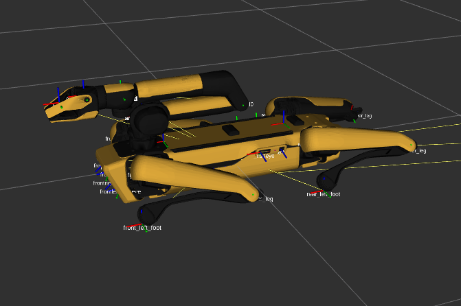
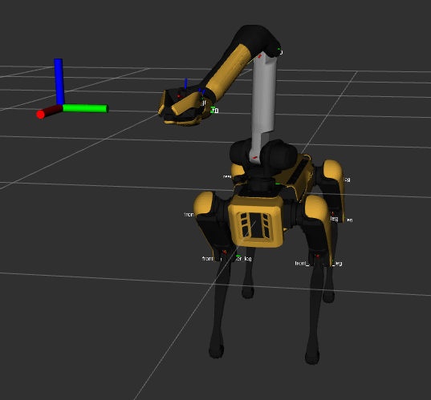

# spot_skills

Motion-planning-based skills for Boston Dynamics' Spot robot

## Cloning with Submodules

This repository includes others, such as [`spot_ros`](https://github.com/heuristicus/spot_ros), as nested submodules. To ensure that all submodules are cloned alongside this repository, use the command:

```bash
git clone --recurse-submodules git@github.com:Benned-H/spot_skills.git
```

If you have already cloned the repository, run the following command to ensure that all submodules are up-to-date:

```bash
bash docker/git_pull_all.sh
```

## Docker Commands

This repository uses Docker to standardize its workspace across machines. Ignoring most of the details, you'll only need to know the following:

- To run the Spot skills code, you'll need to enter a Docker container, which has all the dependencies pre-installed.
- The exact Docker container you should enter depends on your local machine: Is it macOS or Ubuntu? Does it have NVIDIA?

Run the following script to select, launch, and then enter the appropriate container for your machine:

```bash
bash docker/launch.sh
```

To enter the running container in another terminal, just run the same script again.

_Troubleshooting_:

1. If the launch script isn't working, check that you've successfully pulled all submodules. Use:
   - `git submodule update --init --recursive`
2. Try the following command to see the errors preventing you from entering Docker. Replace `SERVICE_NAME` with the name of the service that you're unable to enter (e.g., `spot-tamp-gpu-v2` is the service name in `Selected Docker service: 'spot-tamp-gpu-v2'`).

```bash
docker compose up --pull missing SERVICE_NAME
```

## Example Demonstrations

### Docker Demo Setup

All demonstrations should be run from inside the Docker container. Unless otherwise
stated, you need to move to the top-level `spot_skills` folder, build the workspace, and source `devel/setup.bash`. The commands to do this are:

```bash
# Assumes you're inside the Docker container
cd /docker/spot_skills
catkin build
source devel/setup.bash
```

If a demo requires a second or third terminal tab to be opened into Docker, move to the same directory and source `devel/setup.bash`.

```bash
# For a second, third, etc. terminal tab in Docker
cd /docker/spot_skills
source devel/setup.bash
```

### Long Trajectory Using Spot SDK (Real-World)

In this real-world demonstration, Spot will use its arm to follow a 20-second trajectory. To run the demo, perform the following steps:

1. Use the tablet to teleoperate Spot to an open area free of obstacles.
   Make sure there's space in front of Spot for Spot's arm to fully extend.

2. Use the tablet to make Spot sit, which may be hidden under the _Stand_ menu. Then,
   release tablet control of Spot by entering the _Power Button_ menu (top of the
   screen), then tapping _Advanced_, and selecting **Release Control**.

   - _Check_: Are Spot's front lights now flashing rainbow?

3. On your computer, make sure you've followed the **Docker Demo Setup** instructions above.
   We will need _two_ terminal tabs to be opened into Docker.

4. We're now ready to run the demo. In the first tab, run the following command, with the name of
   the Spot you're using in place of `NAME_HERE` (e.g., `spot_name:=helter`):

```bash
roslaunch spot_skills authenticate_spot_driver.launch spot_name:=NAME_HERE
```

That command will bring up RViz, which may initially show a bugged-out simulated Spot.
Wait a bit until you see the Spot sitting as it is in the real world, something like:



5. In the second terminal tab, run the following command (make sure to source `devel/setup.bash` first):

```bash
rosrun spot_skills arm_long_trajectory_demo.py
```

Spot should power on, stand up, deploy its arm, and begin executing the trajectory.
Once the trajectory is complete, Spot should stow its arm, sit down, power off, and the demo driver will end by saying:

```
[INFO] [...]: Finished running the long joint trajectory.
```

### Control Spot's Arm using MoveIt

In this demonstration, we use MoveIt to move Spot's arm left-and-right in a repeating path.
The demo can be run in simulation (default) or on the real robot (work in progress).

**Simulated Version** - To run this demo in simulation, open a terminal into Docker and follow
the **Docker Demo Setup** instructions above. Then, run the command:

```bash
roslaunch spot_skills moveit_spot_demo.launch
```

RViz should open, showing a simulated Spot. A target pose for Spot's
end-effector should soon be displayed as RGB axes. As this target pose moves
back-and-forth, MoveIt creates motion plans to the target, which are then used to
control the simulated Spot's arm. An example screenshot from the demo is shown below.



**Real Robot Version** - To run this demo using a real robot, perform the following steps:

1. Use the tablet to teleoperate Spot to an open area free of obstacles.
   Make sure there's space in front of Spot for Spot's arm to fully extend.
2. Use the tablet to make Spot sit, which may be hidden under the _Stand_ menu. Then,
   release tablet control of Spot by entering the _Power Button_ menu (top of the
   screen), then tapping _Advanced_, and selecting **Release Control**.
   - _Check_: Are Spot's front lights now flashing rainbow?
3. On your computer, make sure you've followed the **Docker Demo Setup** instructions above.
   We will need two terminal tabs opened into Docker.
4. We will need to tell ROS which Spot we're using. Note the name of the Spot robot you're using (e.g., `snouter`).
5. Now, launch the real-robot demo using the following command, replacing `<SPOT-NAME>` with your Spot's name:

```bash
roslaunch spot_skills moveit_spot_demo.launch real_robot:=true spot_name:=<SPOT-NAME>
```

6. In the second Docker terminal tab, source `devel/setup.bash`, and then run:

```bash
rosrun spot_skills spot_moveit_demo.py
```

### Using `spot_move_base`

The Docker container will have handled the installation of any additional dependencies.

To launch `spot_move_base` and `rtabmap`, run the command:

```bash
roslaunch spot_move_base spot_navigation.launch
```

You can adjust the local planning in the following ways:

- `move_base` for global and local planning - Comment out the line saying `<remap from="cmd_vel" to="/null/cmd_vel" />` in `spot_move_base/launch/move_base.launch`. This sends velocities directly to Spot, which may produce jerky motion depending on the latency.
- `move_base` for global planning and custom Spot local controller - Start `spot_navigation.launch`, then run the following command:

```bash
rosrun spot_move_base send_traj.py
```

This node sends every 60th point in the global planner trajectory to `/spot/go_to_pose`. This can be smoother than the `move_base` method when using WiFi.

### Using `spot_rtabmap`

We need to compile `rtabmap` using a special flag to support multiple cameras. Therefore, we have included `rtabmap_ros` as a submodule of `spot_skills`. The Docker's entrypoint script should have already installed the dependencies of `rtabmap_ros`, so all we need to do is `catkin build` with a special flag ([source](https://github.com/introlab/rtabmap_ros/issues/453)):

```bash
catkin build rtabmap_ros -DRTABMAP_SYNC_MULTI_RGBD=ON
```

You can change the minimum/maximum height of the point cloud by editing `config/spot_cloud_filter.yaml`.
