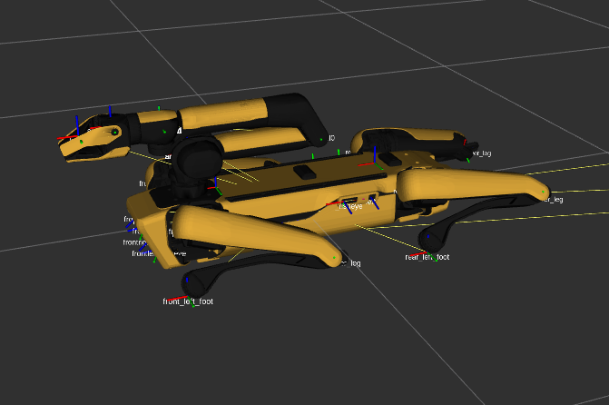
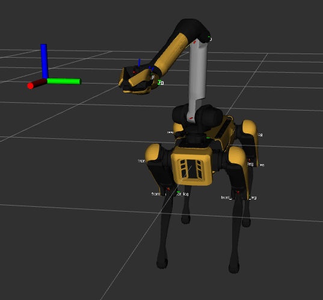

# spot_skills

Motion-planning-based skills for Boston Dynamics' Spot robot

## Cloning with Submodules

This repository includes others, such as [`spot_ros`](https://github.com/heuristicus/spot_ros), as nested submodules. To ensure that all submodules are cloned alongside this repository, use the command:

```bash
git clone --recurse-submodules https://github.com/Benned-H/spot_skills.git
```

If you have already cloned the repository, run the following command to ensure that the submodules are initialized and updated:

```bash
git submodule update --init --recursive
```

## Docker Commands

This repository uses Docker to standardize its workspace across machines. The `compose.yaml` defines a Docker service for several development use cases, varying across the inclusion or exclusion of ROS 1 Noetic and MoveIt 1, the Spot SDK, and GPU support:

- **Spot SDK** - `spot-sdk`
- **Spot SDK with ROS 1 Noetic and MoveIt 1 (w/o GPU)** - `spot-moveit`
- **Spot SDK with ROS 1 Noetic and MoveIt 1 (w/ NVIDIA GPU)** - `spot-moveit-gpu`

To select a service, you'll need its service name (e.g., `spot-moveit`), which you can copy to your clipboard. In the following commands, replace `<SERVICE_NAME>` with the chosen name.

To create, start, and enter the selected container, run the commands:

```bash
docker compose up --detach --pull missing <SERVICE_NAME>
xhost +local:docker
docker compose exec <SERVICE_NAME> bash
```

To enter the running container in another terminal, just run the `docker compose exec`
command, using the correct service name:

```bash
docker compose exec <SERVICE_NAME> bash
```

## Working with the Spot ROS 1 Driver

Before launching the Spot driver, navigate to `/docker/spot_skills` in the container, then run:

```bash
rosdep install -y --from-paths src --ignore-src --rosdistro noetic
pip3 install -e src/spot_ros/spot_wrapper/
```

Then, run each of these commands:

```bash
catkin clean
catkin build
source devel/setup.bash
```

## Example Demonstrations

### Docker Demo Setup

All demonstrations should be run from inside the Docker container. Unless otherwise
stated, you need to move to the top-level `spot_skills` folder, build the workspace, and
source `devel/setup.bash`. The commands to do this are:

```bash
# Assumes you're inside the Docker container
cd /docker/spot_skills
catkin build
source devel/setup.bash
```

If a demo requires a second or third terminal tab to be opened into Docker, that tab will need to move to the same directiory and source `devel/setup.bash`.

```bash
# For a second, third, etc. terminal tab in Docker
cd /docker/spot_skills
source devel/setup.bash
```

### Long Trajectory Using Spot SDK

In this real-world demonstration, Spot will use its arm to follow a 20-second trajectory. To run the demo, perform the following steps:

1. Use the tablet to teleoperate Spot to an open area free of obstacles.
   Make sure there's space in front of Spot for Spot's arm to fully extend.

2. Use the tablet to make Spot sit, which may be hidden under the _Stand_ menu. Then,
   release tablet control of Spot by entering the _Power Button_ menu (top of the
   screen), then tapping _Advanced_, and selecting **Release Control**.

   - _Check_: Are Spot's front lights now flashing rainbow?

3. On your computer, make sure you've followed the **Docker Demo Setup** instructions above.
   We will need _two_ terminal tabs to be opened into Docker.

4. We need to tell ROS which Spot we're using. Run the following command in the first tab, with `spot_name` substituted for the Spot you're using (e.g., `snouter`):

```bash
export SPOT_NAME=spot_name
```

5. We're now ready to run the demo. In the first tab, run the command:

```bash
roslaunch spot_skills arm_long_trajectory_demo.launch spot_name:=$SPOT_NAME
```

That command will bring up RViz, which may initially show a bugged-out simulated Spot.
Wait a bit until you see the Spot sitting as it is in the real world, something like:



6. In the second terminal tab, run the following command (make sure to source `devel/setup.bash` first):

```bash
rosrun spot_skills arm_long_trajectory_demo.py
```

Spot should power on, stand up, deploy its arm, and begin executing the trajectory.
Once the trajectory is complete, Spot should stow its arm, sit down, power off, and the demo driver will end by saying:

```
[INFO] [...]: Finished running the long joint trajectory.
```

### Control Spot's Arm using MoveIt

In this demonstration, we use MoveIt to move Spot's arm left-and-right in a repeating path.
The demo can be run in simulation (default) or on the real robot (work in progress).

**Simulated Version** - To run this demo in simulation, open a terminal into Docker and follow
the **Docker Demo Setup** instructions above. Then, run the command:

```bash
roslaunch spot_skills moveit_spot_demo.launch
```

RViz should open, showing a simulated Spot. A target pose for Spot's
end-effector should soon be displayed as RGB axes. As this target pose moves
back-and-forth, MoveIt creates motion plans to the target, which are then used to
control the simulated Spot's arm. An example screenshot from the demo is shown below.



**Real Robot Version** - To run this demo using a real robot, perform the following steps:

1. Use the tablet to teleoperate Spot to an open area free of obstacles.
   Make sure there's space in front of Spot for Spot's arm to fully extend.
2. Use the tablet to make Spot sit, which may be hidden under the _Stand_ menu. Then,
   release tablet control of Spot by entering the _Power Button_ menu (top of the
   screen), then tapping _Advanced_, and selecting **Release Control**.
   - _Check_: Are Spot's front lights now flashing rainbow?
3. On your computer, make sure you've followed the **Docker Demo Setup** instructions above.
   We will need two terminal tabs opened into Docker.
4. We will need to tell ROS which Spot we're using. Note the name of the Spot robot you're using (e.g., `snouter`).
5. Now, launch the real-robot demo using the following command, replacing `<SPOT-NAME>` with your Spot's name:

```bash
roslaunch spot_skills moveit_spot_demo.launch real_robot:=true spot_name:=<SPOT-NAME>
```

6. In the second Docker terminal tab, source `devel/setup.bash`, and then run:

```bash
rosrun spot_skills spot_moveit_demo.py
```

## Sample Put-Down and Grasp Poses

In this demo, we visualize numerous randomly sampled put-down and grasping poses in RViz.

**Note**: This demo has been superseded by sampling code from a separate, TAMP-dedicated codebase. When the demo _was_ working, it could be run using the commands:

```bash
pip install -r src/spot_skills/requirements.txt
source devel/setup.bash
roslaunch spot_skills sample_poses.launch
```
